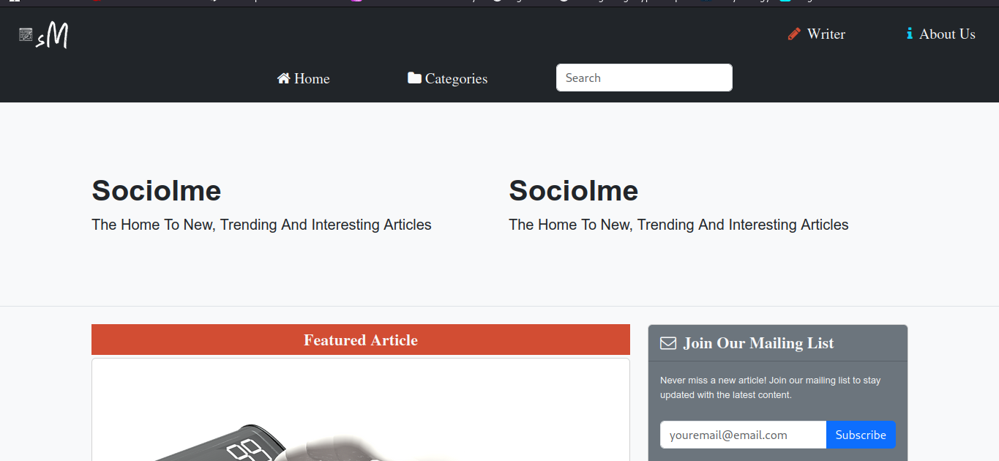
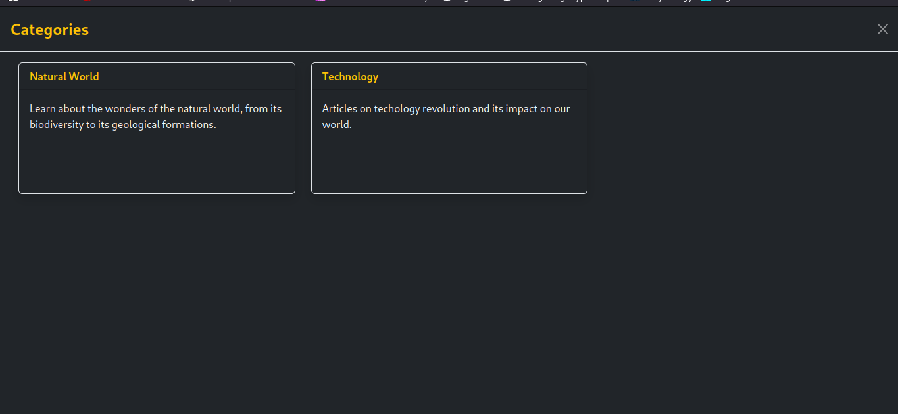
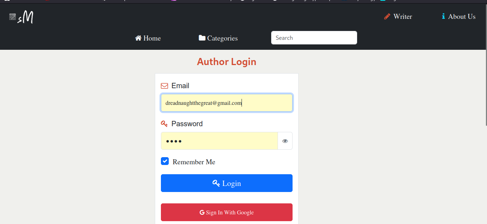

# PHP, MySQL, JQuery and TinyMCE Blogging Website
Welcome to my blog application

## Languages used:
1. PHP
2. JavaScript

The project is built on `HTML5` and `Bootstrap 5`.

## Getting Started

To get started with this project:

1. **Clone the Repository**
```bash
git clone https://github.com/patrickkariukikabita/curiouschronicles.git
```
or download the code from this repository.

2. **Adding Custom URL Rewrite Rules**

    This project uses a custom `.htaccess` file for URL rewrite rules. Add these lines to the existing `.htaccess` file or create one:

```bash
RewriteCond %{HTTPS} !=on
RewriteCond %{REQUEST_URI} !^/pico/.*$
RewriteRule ^(.*)$ https://%{HTTP_HOST}%{REQUEST_URI} [L,R=301]

# SEO-friendly redirect rules
RewriteCond %{REQUEST_FILENAME} !-f
RewriteCond %{REQUEST_FILENAME} !-d
RewriteRule ^article/([a-zA-Z0-9-]+)/?$ articles/articles.php?art=$1 [QSA,L]
RewriteRule ^author/([a-zA-Z0-9-]+)/?$ author/authorArticles.php?author=$1 [QSA,L]
RewriteRule ^category/([a-zA-Z0-9-]+)/?$ categories/category.php?cat=$1 [QSA,L]

# Handling sitemap XML
RewriteRule ^sitemap\.xml/?$ seoTools/sitemap.php

# Custom error pages
ErrorDocument 404 /errors/error.php
ErrorDocument 403 /errors/error.php
ErrorDocument 500 /errors/err500.php
```

3. **Upload the Project to the Server Root**

    Upload all project files to the root directory of your web server.

4. **Navigate to the Project Directory**

```bash
cd curiouschronicles
```

5. **Create a Database**

    Create a MySQL database named `curiouschronicles` and upload the `curiouschronicles.sql` file to populate the database. You can use tools like phpMyAdmin or the MySQL command line for this.

6. **Configure Database Connection**

    Open the `config.php` file in the `resources` directory and update the database connection settings with your database credentials.

```php
$sitename = 'Your Blog Name';
$founderName="Your Name";
$searchLimit=6; // the search depth

// Handling sending gmail-- if on cpanel 
define('GUSER', 'cpanelfromemail');
define('GPWD', 'yourpassword');
define('HOST', 'yourhostingmailserver');
define('FROM', 'Yourcpanelemail');

define('PORT', 587); // modify the port

// handling sign in with google ---when running on cpanel
// Google API configuration
define('GOOGLE_CLIENT_ID', 'client id');
define('GOOGLE_CLIENT_SECRET', 'client secret');
define('GOOGLE_REDIRECT_URL', 'https://[yourdomainname]/author/authorGoogleWaiting.php');
```

```php
private function __construct() {
    // Create a new PDO instance
    $servername = "localhost:3306";
    $username = "[your database username]";
    $password = "[your database password]";
    $dbname = "curiouschronicles";
    // ...other code
}
```
in ```newArticle.php``` in the ```articles``` directory modify this script to add your tinymceToken

```html
  <script src="https://cdn.tiny.cloud/1/[Your tinymce token]/tinymce/6/tinymce.min.js"
    referrerpolicy="origin"></script>
```

7. **Dependencies**

    This project uses the following dependencies:
    - jQuery 3.6.3
    - TinyMCE
    - PHPMailer
    - fb_graph_sdk
    - notify js

8. **Key Features**

    - Writer registration
    - Category creation
    - Trending Categories Section
    - Trending authors section
    - Featured articles
    - WYSIWYG TinyMCE editor
    - Automatic article saving on local storage 
    - Search functionality
    - Founder Section
    - Automatic posting to Facebook

9. **Start the Development Server**

    If you're using a local server environment like XAMPP, WAMP, or MAMP, start the server and ensure that Apache and MySQL are running. If you're on a live server, ensure the server is configured to handle PHP and MySQL.

10. **View the Application**

    Open your web browser and navigate to `http://localhost/curiouschronicles` (for a local server) or your domain name (for a live server) to view and interact with the blog application.

## Additional Information

- **Admin Panel:** The project includes an admin panel for managing blog posts, categories, and authors. Navigate to `http://localhost/curiouschronicles/admin` and log in with the admin credentials you set up in the database.

- **TinyMCE Integration:** The project uses TinyMCE as the WYSIWYG editor for creating and editing blog posts. Ensure you have the required TinyMCE files in the appropriate directory.

- **jQuery:** jQuery is used for enhanced interactivity and AJAX features. Make sure the jQuery library is correctly included in your project.

Enjoy your new blogging website! If you encounter any issues or have questions, refer to the project documentation or contact the project maintainer.

## Project Overview

### Screenshots

Here is a screenshot of the application:
## The Homepage

## Categories Section

## Author Login Section


## Visit My Site

- [www.bytemast.com](https://bytemast.com)

Feel free to explore the project and provide feedback or suggestions.
